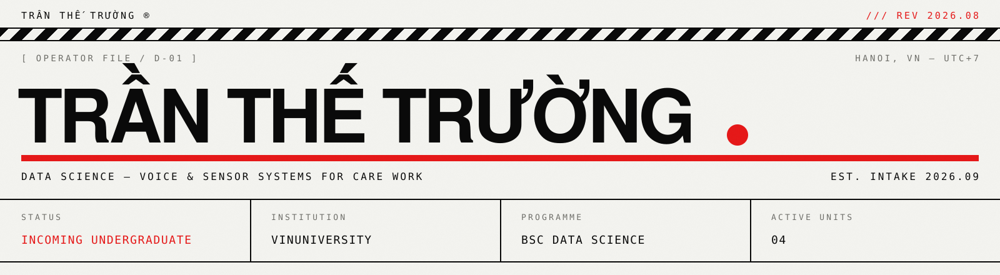

```
[ OPERATOR FILE / D-01 ]  ////////////////////////  HANOI, VN — UTC+7
```

### 01 — OPERATING PRINCIPLE

I build software for care work — the unglamorous, high-stakes kind that happens in clinics and in people's homes. Most of what I make sits between a person who needs help and a family or clinician who can give it.

The through-line is that **a machine should carry the load and a person should keep the judgement**. Which means the interesting engineering problem is usually not the model. It is deciding exactly where the system has to stop — and making it say so plainly when it has not actually done the thing.

### 02 — UNITS

<table>
<tr><td><b>UNIT / 01</b></td><td><b><a href="https://ke-elder-care-web.vercel.app/">Kề</a></b> — “beside”</td><td>● <b>LIVE DEMO</b></td></tr>
</table>

Voice-first care coordination for an older adult and their family. Spoken check-ins and everyday requests in Vietnamese become explicit states a family can review and act on, through a bounded coordinator with eight case states and a full event log.

> **[ DECLARED LIMITS ]**
> Every action stops at coordination or a handoff. An appointment request records a manual clinic contact and returns `booked: false`. A refill records that medicine is running low; it orders nothing. Marking a bill paid changes a local reminder and nothing else. Drawing that line — and making the system refuse to claim it acted — was the hard part.

`STACK` Next.js / Express / FastAPI  ·  `DOMAIN` Elder care  ·  `INTERFACE` Voice

---

<table>
<tr><td><b>UNIT / 02</b></td><td><b><a href="https://carepath-omega.vercel.app/">CarePath</a></b> — AI medical scribe</td><td>● <b>LIVE DEMO</b></td></tr>
</table>

It listens in Vietnamese and writes the clinical note, so the doctor can look at the person instead of the keyboard. Vietnamese is tonal and low-resource, and real consultations braid dialect through Latin drug names — so the work is fine-tuning that survives the transcriber's own mistakes, and measuring **entity-level error on the drug, the dose and the diagnosis** rather than a flattering average over every word.

`STACK` ASR / NLP  ·  `METRIC` Entity-level WER  ·  `LANGUAGE` VI — low-resource

---

<table>
<tr><td><b>UNIT / 03</b></td><td><b><a href="https://github.com/truong-tt/parkinson-fog-device">HopeGait</a></b> — freezing-of-gait detection</td><td>◐ SOURCE</td></tr>
</table>

In Parkinson's the feet stop answering mid-stride, and it is a primary cause of falls. A causal temporal convolutional network reads a wearable IMU — causal because a model that needs the future is no use mid-step — quantised to int8 for a microcontroller at the hip. Cueing only helps if it arrives before the fall, so **the whole design is an argument about latency**. Student research, not a medical device.

`MODEL` Causal TCN  ·  `TARGET` MCU / int8  ·  `SIGNAL` IMU

---

<table>
<tr><td><b>UNIT / 04</b></td><td><b><a href="https://github.com/truong-tt/fpl-ml-manager">FPL ML Manager</a></b> — squad optimiser</td><td>◐ SOURCE</td></tr>
</table>

The same modelling, none of the stakes: quantile regression for point distributions, two-stage minutes prediction, Poisson match goals, and a mixed-integer optimiser picking squad, starting XI, captain and chips. It runs itself twice a day on GitHub Actions and is wrong in public all season. Most of what I know about shipping a model I learned somewhere with a scoreboard and no patients.

`METHOD` Quantile / Poisson  ·  `OPTIMISER` MILP  ·  `CADENCE` 2× daily

### 03 — CONTACT

| CHANNEL | ADDRESS |
|---|---|
| Electronic mail | [tranth3truong@gmail.com](mailto:tranth3truong@gmail.com) |
| Personal index | [truong-tt.github.io](https://truong-tt.github.io/) |
| Professional network | [linkedin.com/in/tru0ng-tr4n](https://www.linkedin.com/in/tru0ng-tr4n/) |

```
© 2026 TRẦN THẾ TRƯỜNG  ///  REV 2026.08
```
